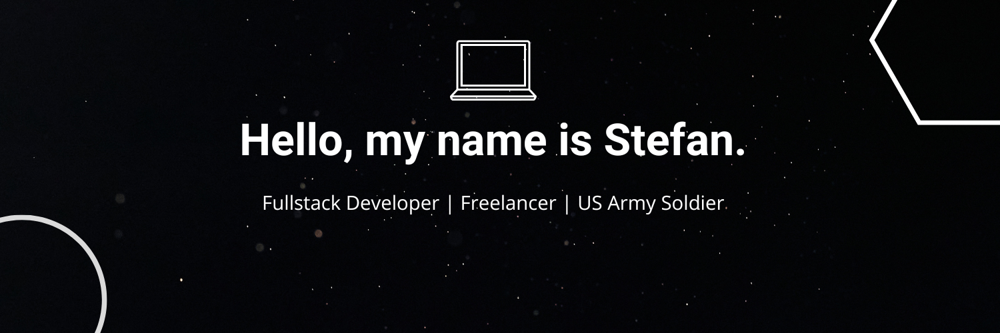
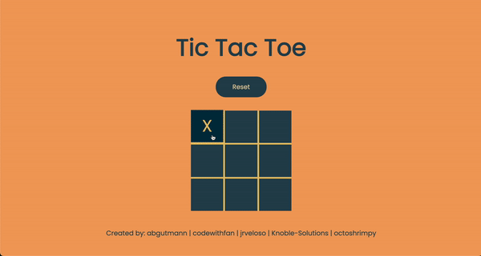

# Stefan Taitano

Passion to serve others, solve problems, and create effective solutions one line of code at a time.

## Tech Stack

## Social Media

<!-- PROJECTS -->

<h2 align="center" color="white">Projects</h2>

	<table>
		<tr>
			<td width="50%">
				<h3 align="center" color="white">Personal Portfolio</h2>
				
  
					
					 
					 
					

						  
							
					

					
<strong>JavaScript, CSS3, HTML5</strong> - Discover my projects, hobbies, and a little about me!

				

			</td>
			<td width="50%">
				<h3 align="center" color="white">Tic Tac Toe</h2>
				
  
					
					 
					 
					

						  
							
					

					 
<strong>JavaScript, CSS3, HTML5</strong> - A 2–player tic-tac-toe battler.

				

			</td>
		</tr>
	</table>
 
 
